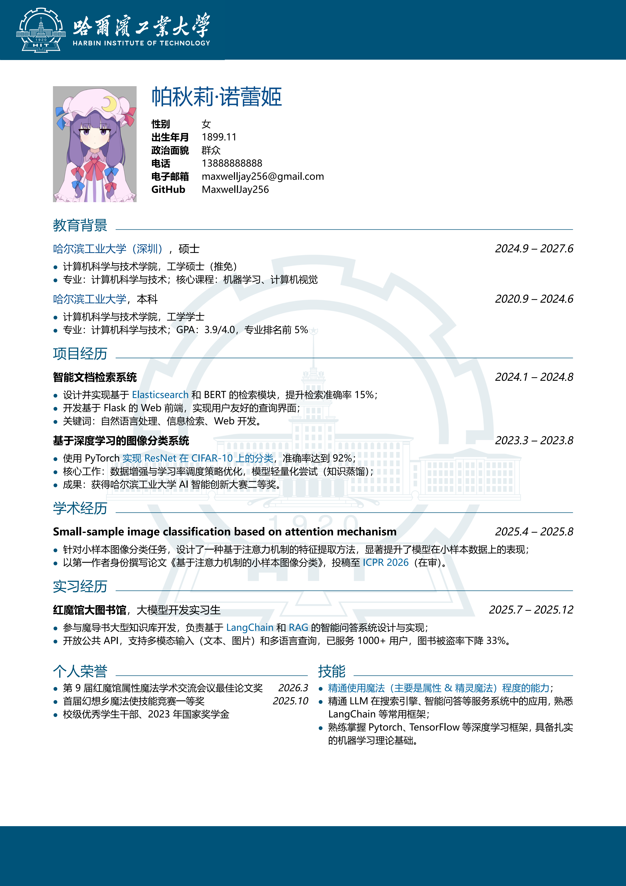
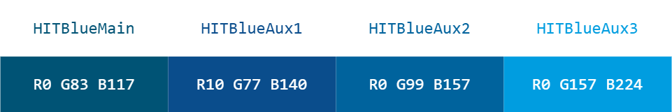

# hitresume

哈尔滨工业大学主题学生 LaTeX 简历模板



## 模板说明 | introduction

hitresume 是一个基于 LaTeX 的简历模板，适合哈尔滨工业大学一校三区学生使用。
模板内校名、校徽和主题颜色参考《哈尔滨工业大学视觉识别系统手册》，符合哈工大的形象规范。

模板设计遵循简洁、高自由度的原则，尽量少定义格式严格的环境，允许用户灵活安排文本格式。

### 特色 | features

1. 页眉页脚填充哈工大蓝，放置醒目的哈工大校徽校名；
2. 预设 4 种《哈尔滨工业大学视觉识别系统手册》中规定的主题色和辅助色；
3. 带有水印开关，用户可以选择是否在简历上添加哈工大校徽水印；
4. 默认正文小字号，方便经历满满的同学在一页内书写更多内容。

## 使用方法 | usage

用户可以直接在 `demo.tex` 的基础上制作自己的简历，内有详细注释说明。

### 文件结构 | file structure

```
hit-resume/
├── images/
│   ├── hit_logo_large.png   % 哈工大校徽，用于水印
│   └── hit_title.png        % 哈工大标志和标准字组合，放置于页眉
├── demo.pdf          % demo.tex 编译后的示例简历
├── demo.tex          % 使用例源文件
├── hitresume.cls     % hitresume 模板类文件
├── README.md         % 说明文档
```

### 编译 | compilation

由于简历用中文书写，请用 XeLaTeX 编译。在根目录下，运行

```bash
xelatex demo.tex
```

即可。

### 字体 & 段落 | fonts & paragraphs

`hitresume.cls` 中默认字体为微软雅黑。

```tex
\RequirePackage[no-math]{fontspec}
\setmainfont{Microsoft YaHei}[AutoFakeSlant=0.2]
\setCJKmainfont{Microsoft YaHei}[AutoFakeSlant=0.2]
\setCJKsansfont{Microsoft YaHei}[AutoFakeSlant=0.2]
\setCJKmonofont{Microsoft YaHei}[AutoFakeSlant=0.2]
```

如果要使用其他字体，请将 `Microsoft YaHei` 替换为你想要的字体名称，并确保系统中已安装该字体。

`hitresume.cls` 指定了 `\Large` `\large` `\normalsize` 的字体大小和行间距，以及段落缩进和间距：

```tex
\renewcommand{\Large}{\fontsize{13pt}{16pt}\selectfont} % {字号}{行距}
\renewcommand{\large}{\fontsize{10pt}{12pt}\selectfont}
\renewcommand{\normalsize}{\fontsize{9pt}{10pt}\selectfont}
\setlength{\parindent}{0pt}   % 段落首行缩进
\setlength{\parskip}{4pt}     % 段落间距
```

以上段落格式偏紧凑，但也允许用户调整这些参数以适应不同的内容量和排版需求。

### 颜色 | colors

`hitresume.cls` 中预设了 4 种颜色，参考《哈尔滨工业大学视觉识别系统手册》A-4-01 和 A-4-02 规范。



推荐用户在简历正文用这 4 种颜色设计图案和高亮文本。

### 自定义环境

1. `personalinfo` 是专用于简历顶部的个人信息栏。
2. `datedsubsection` 是一个带日期标签的 subsection 环境，适合描述经历和项目等内容。
